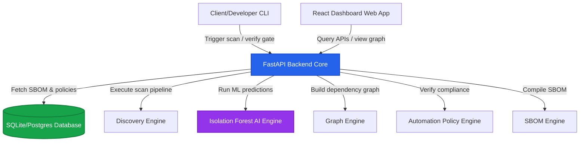

# 🛡️ SBOMGuard AI

> **Next-Generation, AI-Powered Software Supply Chain Security & SBOM Orchestration Platform.**

SBOMGuard is an enterprise-grade security platform designed to automatically discover, audit, analyze, and secure software supply chains. By combining traditional CVE vulnerability matching with advanced **Isolation Forest ML models**, **dependency graph analysis**, and **contextual policy evaluation**, SBOMGuard guards codebases from supply chain threats, malicious dependencies, and licensing violations before they hit production.

---

## 🚀 Key Features

*   **📂 Multi-Ecosystem Repository Discovery**: Automatic detection of languages, ecosystems, and manifest files (`package.json`, `requirements.txt`, `pom.xml`, `Dockerfile`).
*   **🧠 Hybrid AI/ML Security Engine**: Uses scikit-learn Isolation Forest model and rule-based heuristics to flag anomalous packages (obfuscated code, single-maintainer structures, suspicious network calls, low package age).
*   **📊 Dependency Attack Graphs & Blast Radius**: Rebuilds full direct and transitive dependency trees to calculate downstream threat impact scores.
*   **⚡ VEX Context & Remediation Simulation**: Simulation of "What-If" dependency upgrades to preview risk reduction and dependency compatibility.
*   **🛡️ Dynamic CI/CD Gate Policies**: Customizable policies (CVSS, AI anomaly thresholds, forbidden licenses) with automated Jira-like security tickets.
*   **📜 Compliance Reports & Export**: Full generation and verification of signature-backed CycloneDX and SPDX SBOM formats.

---

## 🏗️ System Architecture

The project is structured into three main layers:



### Module Breakdown

1.  **`/backend`**: FastAPI application handling REST endpoints, database schema (via SQLAlchemy), background workers, and the 58 security engines.
2.  **`/frontend`**: Modern React dashboard built with Vite, Tailwind CSS (or custom styling), and Lucide Icons. Features an interactive vulnerability explorer, visual graphs, and policy managers.
3.  **`/cli`**: Python-based CLI client (`sbomguard.py`) for triggering scans locally or within CI/CD pipelines and evaluating security gate exit codes.

---

## 🚦 Getting Started

### Prerequisites

*   Python 3.10+
*   Node.js 18+

### Setup & Run Backend

1. Navigate to the backend directory:
    ```bash
    cd backend
    ```
2. Install Python dependencies:
    ```bash
    pip install -r requirements.txt
    ```
3. Launch the development server:
    ```bash
    uvicorn backend.app.main:app --reload --port 8000
    ```
4. Access interactive docs at [http://localhost:8000/docs](http://localhost:8000/docs).

### Setup & Run Frontend

1. Navigate to the frontend directory:
    ```bash
    cd frontend
    ```
2. Install Node packages:
    ```bash
    npm install
    ```
3. Launch the Vite dev server:
    ```bash
    npm run dev
    ```
4. Open the web app at [http://localhost:5173](http://localhost:5173).

---

## 🛠️ CLI Security Gate Usage

You can test compliance policies locally or in a CI pipeline using the CLI:

```bash
python cli/sbomguard.py --api-url http://localhost:8000 --project-id 1 --path ./demo_vulnerable_project
```

### Exit Codes:
*   `0`: All checks passed.
*   `1`: WARNING (Some dependencies flagged for manual security review).
*   `2`: FAILED (Policies triggered BLOCK action due to critical vulnerabilities).
